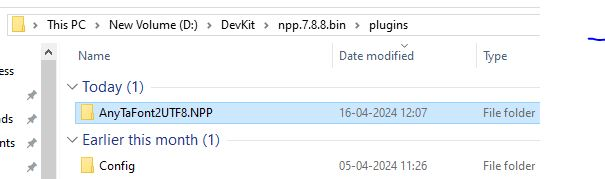

# AnyTaFont2UTF8 Plugin for [Notepad++](https://notepad-plus-plus.org/) 

Any Tamil Font text content to UTF Encoding

# Fonts Collection

https://github.com/ThaniThamizhAkarathiKalanjiyam/tam_ilakiyam/tree/master/Collections/Fonts

# TODO List

- (1) RTF கோப்புகளை மாற்றுதல் 
- (2) இந்த மாற்றியில்  இடும் கோப்பின் அளவின் எல்லை இப்போது என்ன ? Unlimited File Size
- (3) இதன் பிறண்ட  நிலை அதாவது யூனிகோடிலிருந்து மற்றவைகளுக்கு மாற்றுபவை. 

## Run the application & Installation

1. If you are running Notepad++ 7.6 or later:
   * You are encouraged to use [Plugins Admin](https://npp-user-manual.org/docs/plugins/#install-using-plugins-admin) for installation.
   * For manual installation instructions, read: [Install plugin manually](https://npp-user-manual.org/docs/plugins/#install-plugin-manually)
2. If you are running Notepad++ version prior to 7.6: \
   Download and extract the archive from below and move `AnyTaFont2UTF8.NPP.dll` into Notepad++ `plugin` folder.
   * For Notepad++ x86: `C:\Program Files (x86)\Notepad++\plugins` \
   * For Notepad++ x64: `C:\Program Files\Notepad++\plugins`

## Folder Structure

## What It Does

| From Font Name | To Encoding Type |
| -------------- | ---------------- |
| Aishwarya      | UTF8             |
| Anu            | UTF8             |
| Diacritic      | UTF8             |
| Indica         | UTF8             |
| Indoweb        | UTF8             |
| Koeln          | UTF8             |
| Libi           | UTF8             |
| Murasoli       | UTF8             |
| Mylai          | UTF8             |
| Nakkeeran      | UTF8             |
| Oldvikatan     | UTF8             |
| Pallavar       | UTF8             |
| Roman          | UTF8             |
| Shreelipi      | UTF8             |
| Shreelipiavid  | UTF8             |
| Softview       | UTF8             |
| Tab            | UTF8             |
| Tace           | UTF8             |
| Tam            | UTF8             |
| Tscii          | UTF8             |
| UTF8           |                  |
| Vanavil        | UTF8             |
| Webulagam      | UTF8             |

## License

See [LICENSE](./LICENSE) file
