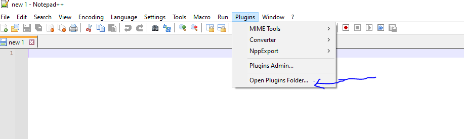
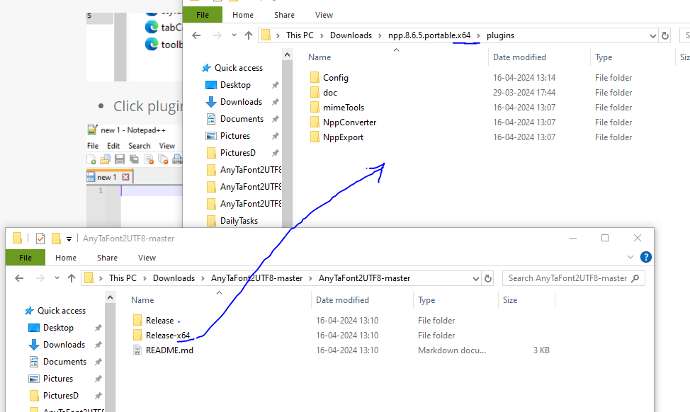
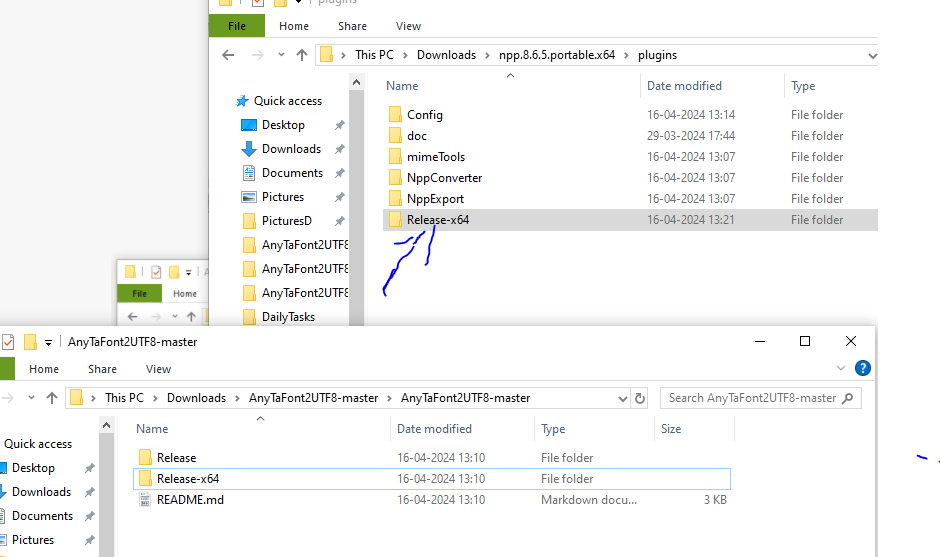
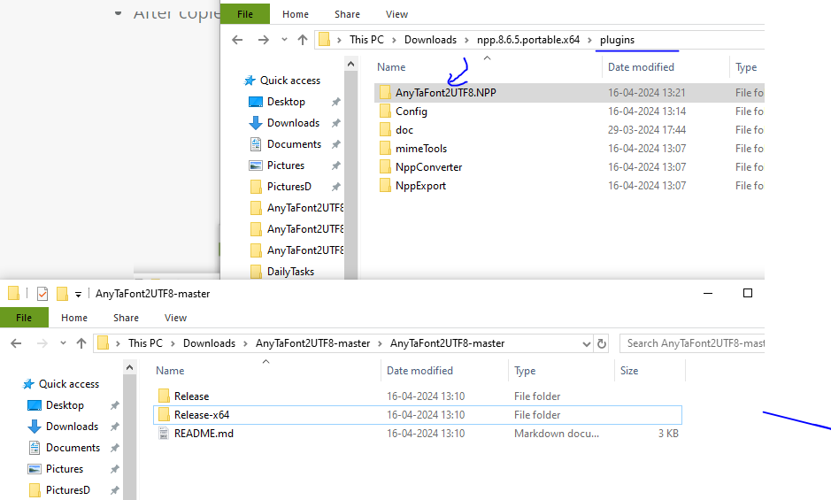
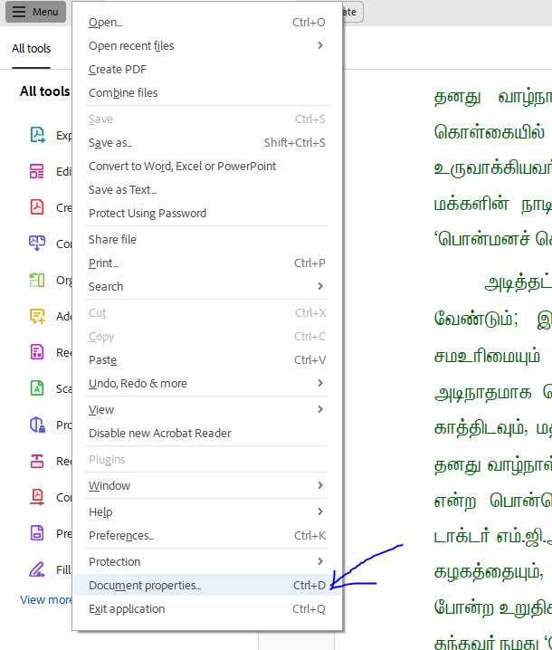
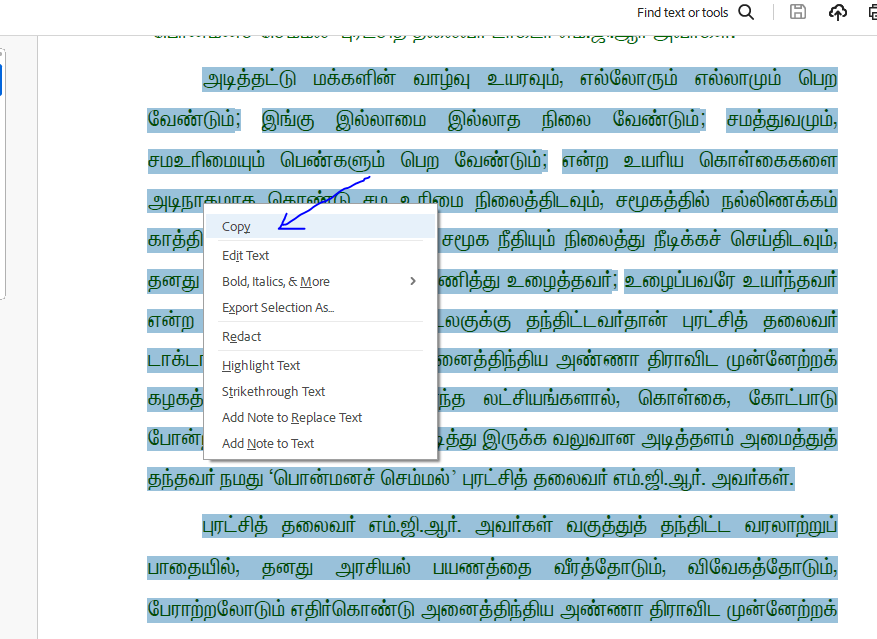
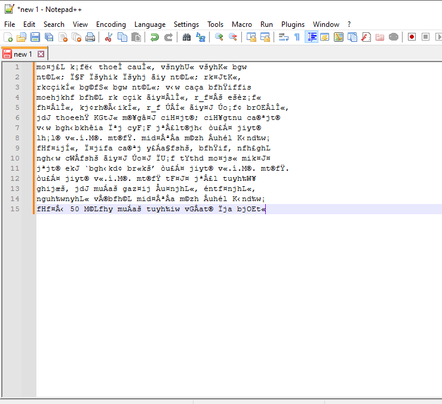
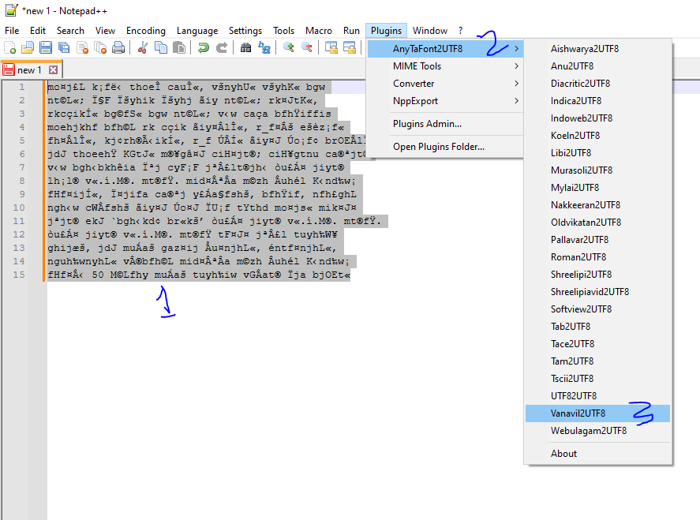
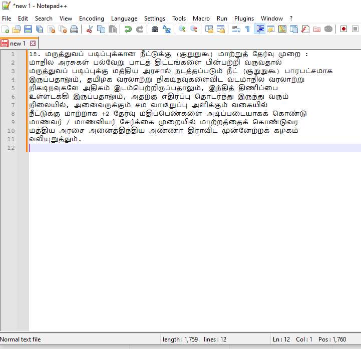

# AnyTaFont2UTF8 Plugin for [Notepad++](https://notepad-plus-plus.org/) 

Any Tamil Font text content to UTF Encoding

# Fonts Collection

https://github.com/ThaniThamizhAkarathiKalanjiyam/tam_ilakiyam/tree/master/Collections/Fonts

# TODO List

- (1) RTF கோப்புகளை மாற்றுதல் 
- (2) இந்த மாற்றியில்  இடும் கோப்பின் அளவின் எல்லை இப்போது என்ன ? Unlimited File Size
- (3) இதன் பிறண்ட  நிலை அதாவது யூனிகோடிலிருந்து மற்றவைகளுக்கு மாற்றுபவை. 

## Run the application & Installation

1. If you are running Notepad++ 7.6 or later:
   * You are encouraged to use [Plugins Admin](https://npp-user-manual.org/docs/plugins/#install-using-plugins-admin) for installation.
   * For manual installation instructions, read: [Install plugin manually](https://npp-user-manual.org/docs/plugins/#install-plugin-manually)
2. If you are running Notepad++ version prior to 7.6: \
   Download and extract the archive from below and move `AnyTaFont2UTF8.NPP.dll` into Notepad++ `plugin` folder.
   * For Notepad++ x86: `C:\Program Files (x86)\Notepad++\plugins` \
   * For Notepad++ x64: `C:\Program Files\Notepad++\plugins`

## Folder Structure

## Files Structure

## How to use the Plugin at Notepad++

- Download Notepad++ from https://notepad-plus-plus.org/downloads/v8.6.5/

- Download latest AnyTaFont2UTF8 from https://codeload.github.com/ThaniThamizhAkarathiKalanjiyam/AnyTaFont2UTF8/zip/refs/heads/master

- Extract AnyTaFont2UTF8-master.zip; It created new folder called AnyTaFont2UTF8-master

- Extract npp.8.6.5.portable.x64.zip; It creates new folder called npp.8.6.5.portable.x64; Go inside the folder there is a file called Notepad++.exe; Click it

- Click plugins menu, then click open Plugin Folder

- Copy After AnyTaFont2UTF8.NPP plugin folder to this folder
  

- After copied the plugin folder seems as below
  
  

- Rename folder Name Release-x64 to AnyTaFont2UTF8 within plugin folder
  

- Now close Notepad++; then reopen

- Now you can see AnyTaFont2UTF8 menu under plugins menu
  

## Word / PDF content to UTF8

- Now i consider i have a pdf; the text are in the Vanavil Format; Open PDF at Adobe Reader; Then click Document Properties from File menu
  
  

- Go to Fonts tab as below

- In the screen Vanavil font is available so i assumed text was created using Vanavil Font.

- Then i select the Page Content from the needed page; like below copy the text and past it to Notepad++
  
  

- After past the text at Notepad++ it seems as below
  
  

- After past the text seems as below
  
  

- We already know the PDF text formated using Vanavil Font; So here I give command to our plugin convert Vanavil Font to UTF8.

- ToDo the conversion Select Text then go to AnyTaFont2UTF8 plugin menu
  

- Our Plugin change the text to UTF8 encoding; 
  
  

- This is our Plugin magic; If you think this is worth means you can share this plugin link to Others.

## What AnyTaFont2UTF8 plugin Does

| From Font Name | To Encoding Type |
| -------------- | ---------------- |
| Aishwarya      | UTF8             |
| Anu            | UTF8             |
| Diacritic      | UTF8             |
| Indica         | UTF8             |
| Indoweb        | UTF8             |
| Koeln          | UTF8             |
| Libi           | UTF8             |
| Murasoli       | UTF8             |
| Mylai          | UTF8             |
| Nakkeeran      | UTF8             |
| Oldvikatan     | UTF8             |
| Pallavar       | UTF8             |
| Roman          | UTF8             |
| Shreelipi      | UTF8             |
| Shreelipiavid  | UTF8             |
| Softview       | UTF8             |
| Tab            | UTF8             |
| Tace           | UTF8             |
| Tam            | UTF8             |
| Tscii          | UTF8             |
| UTF8           |                  |
| Vanavil        | UTF8             |
| Webulagam      | UTF8             |

## License

See [LICENSE](./LICENSE) file
