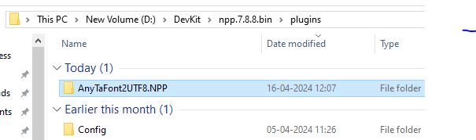

# AnyTaFont2UTF8 Plugin for [Notepad++](https://notepad-plus-plus.org/) 

Any Tamil Font text content to UTF Encoding

# 1. Change Log

| #   | Date      | Description                                                      | Developer      |
| --- | --------- | ---------------------------------------------------------------- | -------------- |
| 1   | 2024Apr14 | Initial release Aishwarya - Webulagam fonts conversion completed | Pitchaimuthu.M |
|     |           |                                                                  |                |
|     |           |                                                                  |                |

# 2. Fonts Collection

https://github.com/ThaniThamizhAkarathiKalanjiyam/tam_ilakiyam/tree/master/Collections/Fonts

# 3. Direct Download Notepad++ with AnyTaFont2UTF8

- You can download directly from https://codeload.github.com/ThaniThamizhAkarathiKalanjiyam/AnyTaFont2UTF8/zip/refs/heads/master

- Extract the downloaded zip file

- Then if you on 32 bit Windows run / click npp.8.6.5.portable >> notepad++.exe

- Else if you on 64 bit windows run / click npp.8.6.5.portable.x64 >> notepad++.exe

- You can have AnyTaFont2UTF8 plugin at Plugins menu as below; Enjoy the Tamil Font conversion tool.
  
  

- For tamil font users above information is enough on installation; If you try to install the plugin manually Go ahead read remaining document.

# 4. TODO List

- (1) RTF கோப்புகளை மாற்றுதல் 
- (2) இந்த மாற்றியில்  இடும் கோப்பின் அளவின் எல்லை இப்போது என்ன ? Unlimited File Size
- (3) இதன் பிறண்ட  நிலை அதாவது யூனிகோடிலிருந்து மற்றவைகளுக்கு மாற்றுபவை. 

## 5. Run the application & Installation

1. If you are running Notepad++ 7.6 or later:
   * You are encouraged to use [Plugins Admin](https://npp-user-manual.org/docs/plugins/#install-using-plugins-admin) for installation.
   * For manual installation instructions, read: [Install plugin manually](https://npp-user-manual.org/docs/plugins/#install-plugin-manually)
2. If you are running Notepad++ version prior to 7.6: \
   Download and extract the archive from below and move `AnyTaFont2UTF8.NPP.dll` into Notepad++ `plugin` folder.
   * For Notepad++ x86: `C:\Program Files (x86)\Notepad++\plugins` \
   * For Notepad++ x64: `C:\Program Files\Notepad++\plugins`

## 6. Folder Structure

## 7. Files Structure

## 8. How to use the Plugin at Notepad++

- Download Notepad++ from https://notepad-plus-plus.org/downloads/v8.6.5/

- Download latest AnyTaFont2UTF8 from https://codeload.github.com/ThaniThamizhAkarathiKalanjiyam/AnyTaFont2UTF8/zip/refs/heads/master

- Extract AnyTaFont2UTF8-master.zip; It created new folder called AnyTaFont2UTF8-master

- Extract npp.8.6.5.portable.x64.zip; It creates new folder called npp.8.6.5.portable.x64; Go inside the folder there is a file called Notepad++.exe; Click it

- Click plugins menu, then click open Plugin Folder

- Copy After AnyTaFont2UTF8.NPP plugin folder to this folder
  

- After copied the plugin folder seems as below
  
  

- Rename folder Name Release-x64 to AnyTaFont2UTF8 within plugin folder
  

- Now close Notepad++; then reopen

- Now you can see AnyTaFont2UTF8 menu under plugins menu
  

## 9. Word / PDF content to UTF8

- Now i consider i have a pdf; the text are in the Vanavil Format; Open PDF at Adobe Reader; Then click Document Properties from File menu
  
  
  
  Go to Fonts tab as below

- In the screen Vanavil font is available so i assumed text was created using Vanavil Font.

- Then i select the Page Content from the needed page; like below copy the text and past it to Notepad++

- For examble take this file tamiltacesamples.rtf i open it in word. and see the document some letters are not in correct font. So I try to copy as like below
  
  
  
  After past the text at Notepad++ it seems as below

- 

- After past the text seems as below
  
  

- We already know the PDF text formated using Vanavil Font; So here I give command to our plugin convert Vanavil Font to UTF8.

- In our exable the Word document contains TACE encoding so i click Tace2UTF8 command from menu as above

- 

- ToDo the conversion Select Text then go to AnyTaFont2UTF8 plugin menu

- Our Plugin change the text to UTF8 encoding; 
  
  

- This is our Plugin magic; If you think this is worth means you can share this plugin link to Others.

## 10. What AnyTaFont2UTF8 plugin Does

| From Font Name | To Encoding Type |
| -------------- | ---------------- |
| Aishwarya      | UTF8             |
| Anu            | UTF8             |
| Diacritic      | UTF8             |
| Indica         | UTF8             |
| Indoweb        | UTF8             |
| Koeln          | UTF8             |
| Libi           | UTF8             |
| Murasoli       | UTF8             |
| Mylai          | UTF8             |
| Nakkeeran      | UTF8             |
| Oldvikatan     | UTF8             |
| Pallavar       | UTF8             |
| Roman          | UTF8             |
| Shreelipi      | UTF8             |
| Shreelipiavid  | UTF8             |
| Softview       | UTF8             |
| Tab            | UTF8             |
| Tace           | UTF8             |
| Tam            | UTF8             |
| Tscii          | UTF8             |
| UTF8           |                  |
| Vanavil        | UTF8             |
| Webulagam      | UTF8             |

## 11. License

AnyTaFont2UTF8 Plugin for Notepad++ © 2009-2024 by Pitchaimuthu M is licensed under Creative Commons Attribution-ShareAlike 4.0 International. To view a copy of this license, visit https://creativecommons.org/licenses/by-sa/4.0/

### You are free to:

1. **Share** — copy and redistribute the material in any medium or format for any purpose, even commercially.
2. **Adapt** — remix, transform, and build upon the material for any purpose, even commercially.
3. The licensor cannot revoke these freedoms as long as you follow the license terms.

### Under the following terms:

1. **Attribution** — You must give [appropriate credit](https://creativecommons.org/licenses/by/4.0/#ref-appropriate-credit) , provide a link to the license, and [indicate if changes were made](https://creativecommons.org/licenses/by/4.0/#ref-indicate-changes) . You may do so in any reasonable manner, but not in any way that suggests the licensor endorses you or your use.
2. **No additional restrictions** — You may not apply legal terms or [technological measures](https://creativecommons.org/licenses/by/4.0/#ref-technological-measures) that legally restrict others from doing anything the license permits.

### Notices:

You do not have to comply with the license for elements of the material in the public domain or where your use is permitted by an applicable [exception or limitation](https://creativecommons.org/licenses/by/4.0/#ref-exception-or-limitation) .

No warranties are given. The license may not give you all of the permissions necessary for your intended use. For example, other rights such as [publicity, privacy, or moral rights](https://creativecommons.org/licenses/by/4.0/#ref-publicity-privacy-or-moral-rights) may limit how you use the material.
